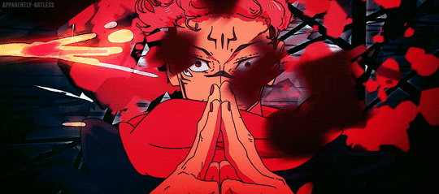

 

  
  <h3 align="left" style="margin-top: -20px; color: #00d4ff; font-weight: 600; letter-spacing: 0.5px;">Creating solutions to problems.</h3>
  
• Identifying them and building them systematically.

  
  

